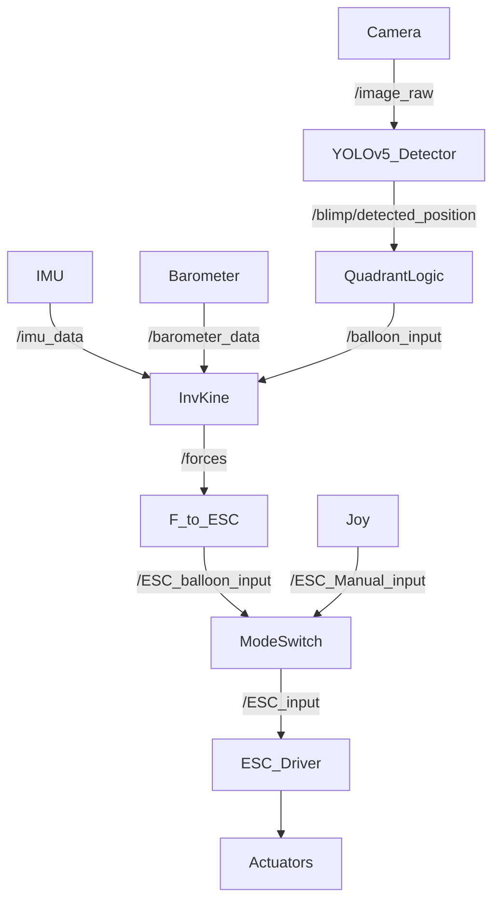
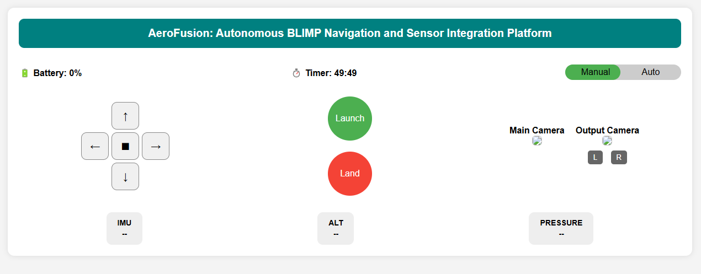

## Experimental Data
(calibrations….)
## Data Format and Content

## Data Filtering
Effective autonomy depends on reliable sensor input. Here’s how the team will manage each:

### Camera (Vision Input)

- **Contrast Enhancement**: Histogram equalization and HSV color space for better robustness under changing lighting.
- **Filtering**: Median filtering and Gaussian blurring to suppress noise.
- **Region of Interest (ROI)**: Focus processing on the central region to improve performance.

### IMU

- **Sensor Fusion**: Combining gyro, accel, and mag data using complementary filters.
- **Filtering**: Low-pass filtering for accel and magnetometer data; high-pass to correct gyro drift.

### Servos

- **PID Controllers (planned)**: For consistent and smooth motion.
- **Encoder Feedback**: To adjust velocity in real time.
- **Noise Filtering**: Reduce jitter in encoder readings via smoothing.

---
## Decision-Making Overview

Sensor data feeds into both short-term (control) and long-term (behavioral) decisions:

### Low-Level Decisions

- Set PWM/servo speeds based on position errors
- Adjust the throttle for altitude
- Stabilize yaw using IMU orientation
- Apply real-time filters for smoother control

### High-Level Decisions

- Use YOLO to detect and localize the balloon
- Estimate relative direction and command movement
- Track proximity to frame center and decide when to stop
- Manage behavioral states: searching → tracking → stop

---

## Updated Sensor Flowchart

## Data Visualization Examples

The current graphical user interface (GUI) is designed using a ROS 2 WebSocket-based architecture to enable real-time monitoring and control of the aerial robot. This approach was selected due to performance limitations observed during early tests, particularly latency and bandwidth issues with direct streaming from the onboard Raspberry Pi using tools like RQT or VNC.  

To overcome these constraints, the team developed a lightweight, browser-accessible GUI that interfaces with ROS 2 via rosbridge_server and roslibjs. This setup allows for JSON-based communication over WebSockets, facilitating seamless interaction with ROS topics, services, and messages.  

**Technologies used:**  

- HTML/CSS/JavaScript: For layout, styling, and interactivity
- roslibjs: For WebSocket communication with ROS 2
- rosbridge_server: Acts as a middleware bridge translating ROS messages into JSON

**Features supported:**  

- Live video streaming from the onboard camera (via MJPEG)
- Real-time visualization of IMU data and telemetry
- Manual control inputs using buttons or joystick events
- System diagnostics and status monitoring

By offloading the GUI rendering to a browser, onboard compute resources are reserved for mission-critical ROS 2 tasks. This results in a responsive, low-latency interface suitable for remote deployment.  

  
*Figure 3: Real-time sensor and control interface for the BLIMP, developed using roslibjs and rosbridge_server over WebSockets.*

<h2>📹 Balloon Tracking Demo</h2>

<video controls autoplay muted loop playsinline width="640" height="360" style="border-radius: 10px; box-shadow: 0 0 10px rgba(0,0,0,0.2);">
  <source src="../videos/balloon_detection.mp4" type="video/mp4">
  Your browser does not support the video tag.

## Summary

The system is now capable of:  

- Detecting and tracking a balloon in real time
- Navigating toward the balloon using differential drive
- Halting autonomously upon reaching the success zone
- Publishing and processing filtered IMU sensor data

Next Steps:  

- Fully synchronize the GUI with detection and motor control nodes
- Implement PID control for smoother and more stable navigation
- Add fallback mechanisms when the target is lost
- Fine-tune success detection thresholds
- Log and evaluate system performance using rosbag
