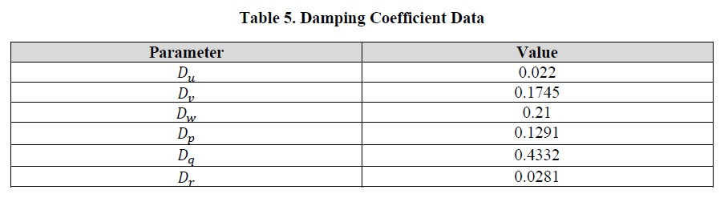

## Experimental Calculations

The thrust coefficient matrix can be calculated directly from thrust stand data. In this test, a known PWM (pulse width modulation) signal is sent to the motor, which is attached to a stationary stand that measures the thrust force of the motor configuration. The current vehicle configuration uses a Park 180 motor for the left and right thrusters and a Park 250 motor for the up and down motors. A step test was performed for each motor in which the PWM signal was varied from 1100 to 1800 in increments of 50, and the resulting data is shown in Table 4 below.

 

The data above was then plotted for each motor. As Figures 4 and 5 below illustrate, Thrust vs. PWM exhibits a near-linear relationship. Thus, a linear equation was fit to the data to be used in the thrust coefficient matrix.  

 

Unlike previously identified parameters, damping effects are less straightforward to calculate. Wind tunnel testing or computer-aided computational fluid dynamics tests can be used to identify the parameters. Another option, and the chosen one for this project, is dynamic testing. For this test, the MoCap Lab and the Vicon System in the lab ( TECH 189) are used to accurately track the vehicle's state during flight tests. The Vicon system uses a series of infrared cameras and, when properly calibrated, can accurately provide dynamic measurements down to 0.017 mm on average [source]. During testing, motor inputs were recorded alongside Vicon data measurements. After running multiple free-flight test trials, the data reduction was performed using MATLAB to calculate the damping coefficient at each time step. The median of this data was then used to represent the damping coefficient for a singular test, and then the average of all trials was taken. This experiment resulted in the following data for the damping coefficient.  

 

It should also be noted that, ideally, single DOF tests would be performed at constant velocities. Thus, eliminating acceleration and thereby mass effects, and also minimizing any potential coupling effects between the parameters. However, due to limited control, all 6 DOF cannot be independently controlled and achieving a constant velocity in an enclosed space can be difficult. Therefore, it was assumed that various flight tests would be sufficient for the calculation.  

## Data Filtering

### IMU Data

The linear acceleration in the X-axis was plotted against time, providing a clear representation of the motion profile over the recorded duration. We have Plotted the raw data using Matplotlib and labeled the axes for clarity.

The team applied a linear FIR filter to the raw IMU data. This was done to demonstrate how data can be smoothed in real-time. Since the team could not perform forward and backward convolutions in real-time, the team chose a simple FIR filter and applied it to the recorded data. The original and filtered data were plotted on the same graph to compare the effects of the filter.

Mathematically, the output y[n] of an FIR filter is given by the following equation:

The filter coefficients 𝑏𝑘 are derived to minimize the difference between the actual and desired responses in the frequency domain.
Steps:
- Selected an FIR filter and applied it to the raw data.
- Plotted both the original and filtered data for comparison.
- Discussed trade-offs regarding the filter window size and the need to truncate time values.

### Camera (Vision Input)
- The camera is used to get the input of the surrounding and train the YOLO model on those inputs
- As the camera detects some object of interest it gets its location in 3-Dimention (X, Y, Z).
- Finally based on this input and the position of the detected object with respect to the camera, the controller provides PWM signals to the motors for actuation.

### Electronic Speed Controllers (ESCs)

The ESCs are given input via PWM pins and the values are calculated based on PID gains. The Kp, Kd, and Ki values help the controller to provide exact PWM signal to the ESCs to move the blimp Manually and Autonomously.

## Updated Sensor Flowchart

## Data Visualization Examples

The current graphical user interface (GUI) is designed using a ROS 2 WebSocket-based architecture to enable real-time monitoring and control of the aerial robot. This approach was selected due to performance limitations observed during early tests, particularly latency and bandwidth issues with direct streaming from the onboard Raspberry Pi using tools like RQT or VNC.  

To overcome these constraints, the team developed a lightweight, browser-accessible GUI that interfaces with ROS 2 via rosbridge_server and roslibjs. This setup allows for JSON-based communication over WebSockets, facilitating seamless interaction with ROS topics, services, and messages.  

**Technologies used:**  

- HTML/CSS/JavaScript: For layout, styling, and interactivity
- roslibjs: For WebSocket communication with ROS 2
- rosbridge_server: Acts as a middleware bridge translating ROS messages into JSON

**Features supported:**  

- Live video streaming from the onboard camera (via MJPEG)
- Real-time visualization of IMU data and telemetry
- Manual control inputs using buttons or joystick events
- System diagnostics and status monitoring

By offloading the GUI rendering to a browser, onboard compute resources are reserved for mission-critical ROS 2 tasks. This results in a responsive, low-latency interface suitable for remote deployment.  

  
*Figure 3: Real-time sensor and control interface for the BLIMP, developed using roslibjs and rosbridge_server over WebSockets.*

<h2>📹 Balloon Tracking Demo</h2>

<video controls autoplay muted loop playsinline width="640" height="360" style="border-radius: 10px; box-shadow: 0 0 10px rgba(0,0,0,0.2);">
  <source src="../videos/balloon_detection.mp4" type="video/mp4">
  Your browser does not support the video tag.

## Summary

The system is now capable of:  

- Detecting and tracking a balloon in real time
- Navigating toward the balloon using differential drive
- Halting autonomously upon reaching the success zone
- Publishing and processing filtered IMU sensor data

Next Steps:  

- Fully synchronize the GUI with detection and motor control nodes
- Implement PID control for smoother and more stable navigation
- Add fallback mechanisms when the target is lost
- Fine-tune success detection thresholds
- Log and evaluate system performance using rosbag
