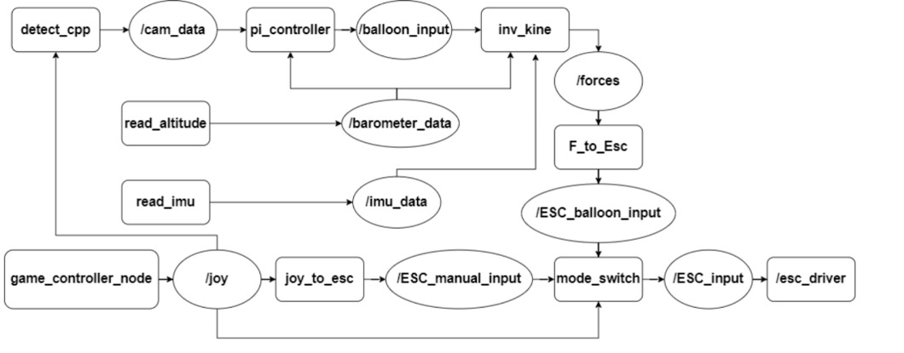

## 1. **Code Repository**

[https://github.com/RAS598-2025-S-Team03/BLIMP-Packages](https://github.com/RAS598-2025-S-Team03/BLIMP-Packages)

## 2. **System Prerequisites**

Before deploying the autonomous blimp system, ensure the following hardware and software components are properly installed and configured:

- A Raspberry Pi (with SSH access enabled)
- Required Python libraries including `rclpy`, `pigpio`, `adafruit_bno055`, `adafruit_bmp3xx`, `numpy`, and related dependencies
- `pigpio` daemon running for motor PWM control
- ROS 2 Humble (or compatible ROS 2 distribution) fully set up along with additional packages such as `ros-humble-web-video-server`, `ros-humble-rosbridge-server` and any other additional packages needed while installing `ros-humble-desktop`
- Xbox controller paired to the Raspberry Pi via Bluetooth and install this package (`xboxdrv`) via apt repository.
- Access to the `BLIMP-Packages` ROS 2 workspace cloned from the repository:
  [https://github.com/RAS598-2025-S-Team03/BLIMP-Packages](https://github.com/RAS598-2025-S-Team03/BLIMP-Packages)

---

## 3. **Deployment and Launch Instructions**

To run the complete autonomous system on the Raspberry Pi:

**1. Create a ROS2 Workspace :**  
```mkdir -p ~/blimp_ws/src```

**2. Navigate to the launch directory within the ROS 2 workspace and clone the repository:**  
```cd ~/blimp_ws/src/ && git clone https://github.com/RAS598-2025-S-Team03/BLIMP-Packages.git ```

**3. Build the blimp_intefaces package first then the rest of the repo**  
  
    -  ```cd ~/blimp_ws/ && colcon build --packages-select blimp_interfaces ```
  
    - ```source install/setup.bash ```

    - ```colcon build ```
**4. (Optional) Install and build all the necessary packages required for the Oak-D Lite camera within another ROS 2 workspace:**
    
    -  ``` sudo wget -qO- https://raw.githubusercontent.com/luxonis/depthai-ros/main/install_dependencies.sh | sudo bash ```

    -  ``` mkdir -p camera_ws/src ```
  
    - ``` rosdep update ```

    -  ```cd camera_ws/src```
  
    -  ```git clone --branch humble https://github.com/luxonis/depthai-ros.git```

    -  ```cd ..```

    -  ```rosdep install --from-paths src --ignore-src -r -y```

    -  ```source /opt/ros/humble/setup.bash```
  
    -  ```MAKEFLAGS="-j1 -l1" colcon build```

    -  ```source install/setup.bash```

**4. Initialize the game controller node to verify that joystick inputs are being received:**  
```ros2 run joy game_controller_node```

**5. Arm the ESCs before flight using the custom arming script:**  
```ros2 launch auto_control arming.py```

**6. Launch all nodes together using the master launch file:**  
```ros2 launch auto_control updated_launch.py```

**7. (Optional) Launch the camera nodes for the Oak-D Lite Camera**
```ros2 launch depthai_ros_filters spatial_bb.launch.py```  

**8. Launch the web visualizer after all the nodes have been launched successfully**  
```ros2 launch blimp_gui rosbridge_camera_launch.py```

These steps start all relevant ROS 2 nodes for sensor input, control logic, mode switching, and actuator commands. Be sure to confirm that each node is publishing correctly by checking the appropriate topics using `ros2 topic list` or `rqt_graph`.


## 4. **Overview of Code:**

  

### Detect_cpp
The `detect_cpp` node is located at `blimp_ws/BLIMP-Packages/sensors_cpp/src/detect_node.cpp` and is implemented in C++. It subscribes to the `/joy` topic and publishes camera-based detections to `/cam_data`. This node captures images from the onboard camera and operates in two modes: balloon detection and goal detection, toggled using the Xbox controller. Balloon detection uses HSV color space to find the densest region matching the target color. If the region exceeds a minimum radius, the center is averaged over several frames before publishing. Goal detection uses Canny edge detection and Hough line transforms to calculate the goal’s midpoint based on detected vertical and horizontal edges.

### Esc_driver
The `esc_driver` Python node is found in `blimp_ws/BLIMP-Packages/controls/controls/esc_driver.py`. It subscribes to the `/joy` topic and uses `pigpio` to control motor PWM signals. It translates mode-switch inputs into ESC commands and manages communication with the controller over Bluetooth.

### F_to_esc
The `F_to_esc` node, written in C++ at `blimp_ws/BLIMP-Packages/sensors_cpp/src/force_to_ESC_input.cpp`, subscribes to force vectors and publishes motor commands. It performs a pseudo-inverse transformation to convert forces in the body frame into ESC inputs. Dependencies include Eigen for matrix math and custom interfaces for handling Cartesian and PWM data.

### Game_controller_node
This node reads Xbox controller inputs and publishes them to `/joy`. It is built on the standard ROS 2 Joy package and is responsible for providing manual input data to various control nodes.

### Inv_kine
The `inv_kine` node resides in `blimp_ws/BLIMP-Packages/sensors_cpp/src/inv_kine.cpp`. It takes input from `/imu_data`, `/barometer_data`, and `/balloon_input` to estimate forces acting on the blimp. Using these inputs, it publishes force vectors via the `/forces` topic. It incorporates a dynamic model that uses IMU orientation, barometer-based vertical velocity, and visual feedback to determine control outputs.

### Joy_to_esc
Located in `blimp_ws/BLIMP-Packages/controls/controls/joy_to_esc_input.py`, this Python node directly maps joystick commands to ESC inputs for manual control. It serves as a simpler alternative to autonomous control logic when operating in manual mode.

### Mode_switch
The `mode_switch` node selects between manual and autonomous control. It listens to `/ESC_Manual_input`, `/ESC_balloon_input`, and `/joy`, and publishes the final ESC command to `/ESC_input`. It is central to toggling between pilot input and autonomous operation during testing.

### Pi_controller
Implemented in C++ and found at `blimp_ws/BLIMP-Packages/sensors_cpp/src/test.cpp`, this node acts as a PI controller. It receives camera and barometer data and outputs control commands to the inverse kinematic model. Parameters include proportional and integral gains for yaw and vertical acceleration, as well as camera frame center coordinates for error correction.

### Read_altitude
This Python node at `blimp_ws/BLIMP-Packages/sensors/sensors/barometer.py` reads atmospheric pressure using an Adafruit BMP390 and estimates altitude. It publishes data on the `barometer_data` topic and accounts for sea level pressure calibration to improve accuracy.

### Read_imu
The `read_imu` node, written in Python, reads data from the Adafruit BNO055 IMU. It measures Euler angles, linear acceleration, and angular velocity, publishing all data to the `/imu_data` topic. This sensor information supports real-time state estimation for the blimp.


