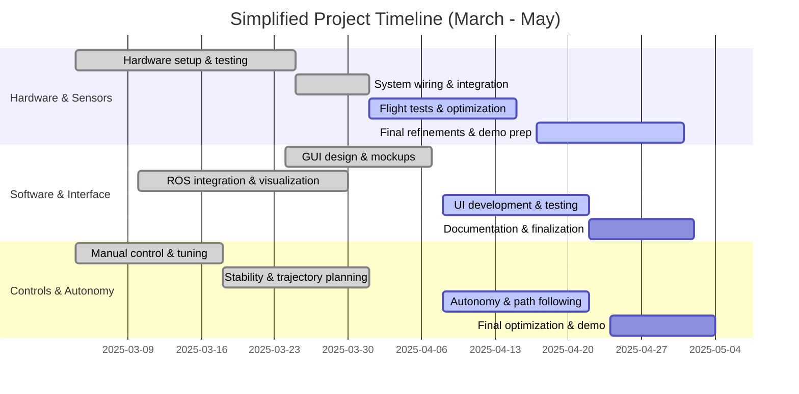

```mermaid
%%{init: {'themeVariables': {'opacity': '1'}}}%%
gantt
    title Simplified Project Timeline (March - May)
    dateFormat  YYYY-MM-DD

    section Hardware & Sensors
    Hardware setup & testing       :done,   2025-03-04, 21d
    System wiring & integration    :done,   2025-03-25, 7d
    Flight tests & optimization    :active, 2025-04-01, 14d
    Final refinements & demo prep  :active, 2025-04-17, 14d

    section Software & Interface
    GUI design & mockups           :done,   2025-03-24, 14d
    ROS integration & visualization:done,   2025-03-10, 20d
    UI development & testing       :active, 2025-04-08, 14d
    Documentation & finalization   :planned, 2025-04-22, 10d

    section Controls & Autonomy
    Manual control & tuning        :done,   2025-03-04, 14d
    Stability & trajectory planning:done,   2025-03-18, 14d
    Autonomy & path following      :active, 2025-04-08, 14d
    Final optimization & demo      :planned, 2025-04-24, 10d
```

