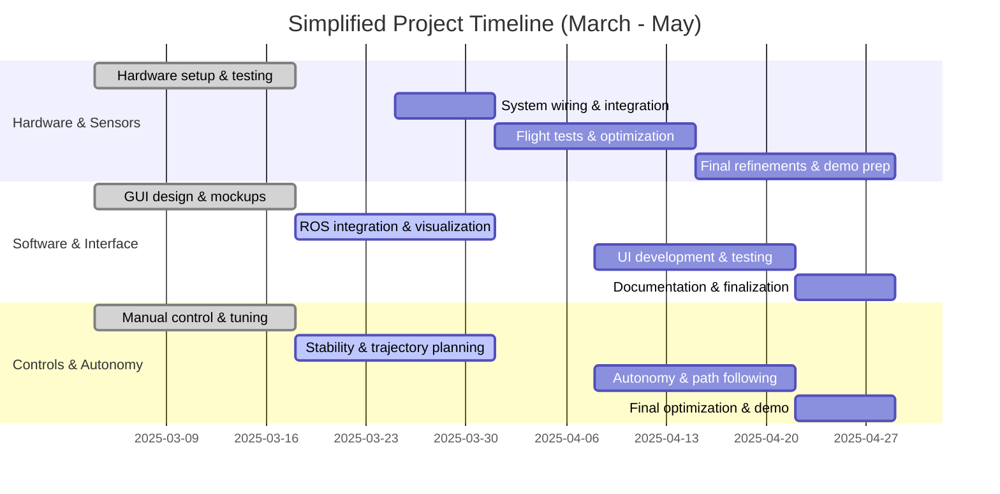

<!-- ```mermaid
%%{init: {'themeVariables': {'opacity': '1'}}}%%
gantt
    title Project Timeline (March - May)
    dateFormat  YYYY-MM-DD
    
    section Hardware
    Finalize hardware setup         :done, 2025-03-04, 7d
    Battery & power testing         :done, 2025-03-11, 7d
    ESC & motor tests               :active, 2025-03-18, 7d
    Full system wiring check        :2025-03-25, 7d
    First flight test               :2025-04-01, 7d
    Propeller optimization          :2025-04-08, 7d
    Flight test refinements         :2025-04-15, 7d
    Demo preparation                :2025-04-22, 7d
    Final presentation prep         :2025-04-29, 7d
    
    section Interface
    Initial GUI design              :done, 2025-03-04, 7d
    GUI mockup                      :done, 2025-03-11, 7d
    GUI ROS integration             :active, 2025-03-18, 7d
    Live sensor visualization       :2025-03-25, 7d
    Data storage setup              :2025-04-01, 7d
    GUI live map view               :2025-04-08, 7d
    Control panel UI                :2025-04-15, 7d
    UI testing                      :2025-04-22, 7d
    User guide documentation        :2025-04-29, 7d
    
    section Sensors
    IMU & GPS testing               :done, 2025-03-04, 7d
    LiDAR & sonar setup             :done, 2025-03-11, 7d
    Sensor data logging             :active, 2025-03-18, 7d
    Sensor calibration              :2025-03-25, 7d
    Sensor fusion start             :2025-04-01, 7d
    Camera processing               :2025-04-08, 7d
    Final sensor tuning             :2025-04-15, 7d
    Validation tests                :2025-04-22, 7d
    Demo readiness                  :2025-04-29, 7d
    
    section Controls & Autonomy
    Basic manual control            :done, 2025-03-04, 7d
    Joystick control tuning         :done, 2025-03-11, 7d
    Altitude stabilization          :active, 2025-03-18, 7d
    Basic trajectory planning       :2025-03-25, 7d
    PID tuning for stability        :2025-04-01, 7d
    Path following algorithm        :2025-04-08, 7d
    Autonomous mode switch          :2025-04-15, 7d
    Final trajectory optimization   :2025-04-22, 7d
    Classroom demonstration         :2025-04-29, 7d
``` -->



