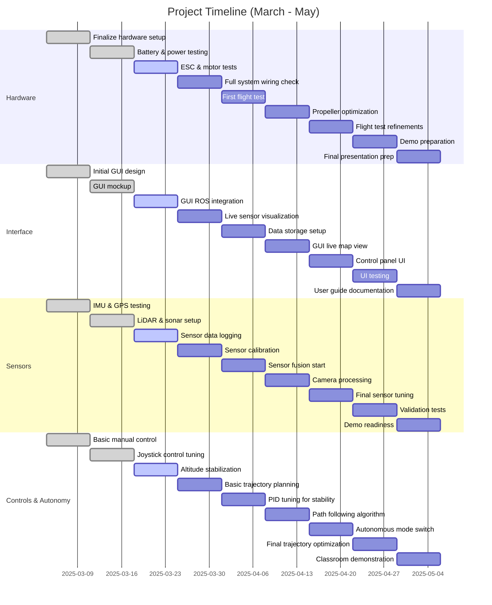

## Milestones

| Week            | Hardware                | Interface            | Sensors               | Controls & Autonomy                                |
|----------------|------------------------|----------------------|----------------------|--------------------------------------------------|
| MAR 4 - MAR 10  | Finalize hardware setup | Initial GUI design  | IMU & GPS testing    | Basic manual control                             |
| MAR 11 - MAR 17 | Battery & power testing | GUI mockup          | LiDAR & sonar setup  | Joystick control tuning                         |
| MAR 18 - MAR 24 | ESC & motor tests       | GUI ROS integration | Sensor data logging  | Altitude stabilization                          |
| MAR 25 - MAR 31 | Full system wiring check| Live sensor visualization | Sensor calibration  | Basic trajectory planning                        |
| APR 1 - APR 7   | First flight test       | Data storage setup  | Sensor fusion start  | PID tuning for stability                        |
| APR 8 - APR 14  | Propeller optimization  | GUI live map view   | Camera processing    | Path following algorithm                        |
| APR 15 - APR 21 | Flight test refinements | Control panel UI    | Final sensor tuning  | Autonomous mode switch                          |
| APR 22 - APR 28 | Demo preparation        | UI testing          | Validation tests     | Final trajectory optimization and full autonomous test |
| APR 29 - MAY 5  | Final presentation prep | User guide documentation | Demo readiness      | Classroom demonstration                         |

## Gantt Chart 

