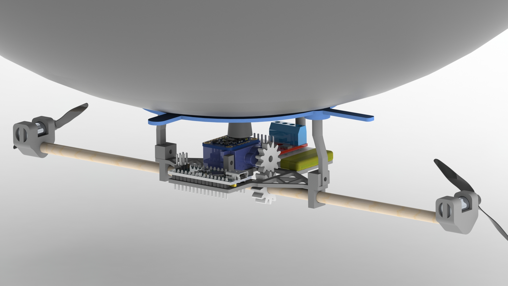

# Home

## AeroFusion: Autonomous BLIMP Navigation and Sensor Integration Platform

## 1. Repository Structure Review

Before diving into the project details, we reviewed the cloned [template](https://embedded-systems-design.github.io/fork-report-website/)  to understand how the folder structure translates to the website. We removed all markdown pages except for **index.md** to prepare the report. This clean setup ensures that our final website only displays the main home page, keeping the structure clear and uncluttered.

## 2. Home Page

**Project Name:**  

_AeroFusion: Autonomous BLIMP Navigation and Sensor Integration Platform_

**Team Number:**  

Team 03

**Team Members:**  

- Nihar Masurkar
- Prajjwal Dutta
- [Sai Srinivas Tatwik Meesala](https://tatwik19.github.io/)

**Semester and Year:**  
Spring 2025

**University, Class, and Professor:**

- **University:** Arizona State University  
- **Class:** RAS 598: Experimentation and Deployment of Robotic Systems
- **Professor:** Dr. Daniel M. Aukes 

## 3. Project Plan

### 3.1 High-Level Concept and Research Question

Our project aims to develop an integrated, sensor-driven framework that enables a Biologically-inspired, Lighter-than-air, Instructional, Mechatronics Program (BLIMP) UAV to operate autonomously in dynamic and uncertain environments.

The central research question is: **"How effectively can sensor data from various sensors (such as Time-of-Flight Sensor, IMU, Barometer, Camera) be fused together to enhance trajectory planning and autonomous navigation capabilities of a hybrid robotic blimp system in dynamic environments?"**
  
  
*Figure 1: CAD Rendering of Biologically-inspired, Lighter-than-air, Instructional, Mechatronics Program (BLIMP) UAV*

### 3.2 Sensor Integration

#### How will you utilize sensor data collected from the robot in your code?

Sensor integration in our project follows a comprehensive, multi-layered approach to ensure that data from each sensor is effectively utilized across all development stages. In our codebase, we've want to implement a modular architecture where sensor data is published on dedicated ROS2 topics. Each sensor continuously streams its specific measurements, allowing for both independent processing and integrated sensor fusion.

Our code utilizes a hierarchical data processing pipeline:

1. **Data Acquisition Layer**: Handles raw sensor input collection at appropriate sampling rates.

2. **Filtering Layer**: Applies Kalman filtering and other noise reduction techniques.

3. **Fusion Layer**: Combines multiple sensor inputs for comprehensive state estimation.

4. **Decision Layer**: Processes fused data to inform navigation and control decisions.

#### How will you use sensors during testing?

During testing, we will validate individual sensor outputs using ROS2 tools like rqt_plot and ros2 topic echo. This methodical approach ensures each sensor is correctly calibrated and operating within expected parameters. Our testing protocol includes:

- **Sensor Isolation Tests**: Verifying each sensor's accuracy and reliability independently.
- **Calibration Verification**: Ensuring sensors maintain accuracy across varying conditions.
- **Interference Testing**: Identifying potential cross-sensor interference issues.
- **Data Consistency Checks**: Confirming consistent readings under controlled conditions.
- **Latency Measurement**: Quantifying processing delays for time-sensitive applications.

These tests will be conducted in both controlled indoor environments and field trials, allowing us to observe how sensor data influences the system's stability, localization accuracy, and obstacle detection capabilities in diverse settings.

#### How will you use sensors in your final demonstration?

In our final demonstration, real-time integration of sensor data will be paramount. Each sensor will play a specific role in enabling autonomous operation:

- **IMU**: Provides orientation control with 6-DoF motion tracking at 200Hz
- **Barometer**: Maintains precise altitude control through atmospheric pressure monitoring
- **GPS**: Enables robust outdoor localization with meter-level accuracy
- **Raspberry Pi Camera**: Supports visual goal detection and obstacle recognition at 30fps
- **Sonar**: Offers proximity detection for immediate collision avoidance
- **ToF Sensor (LiDAR)**: Creates detailed 3D environmental maps for navigation planning

  
*Figure 2: Professional mockup of the BLIMP control and monitoring interface*

This comprehensive sensor array will drive the autonomous control loops, enabling adaptive trajectory planning and responsive mode switching between manual and autonomous control. The demonstration will showcase how our fusion algorithms synthesize this diverse data to create a cohesive understanding of the environment, allowing the BLIMP to navigate reliably in dynamic, real-world scenarios.

### 3.3 Interaction and Interface Development

#### How do you plan on influencing the behavior of your robot?

The behavior of our BLIMP will be influenced through a sophisticated dual-mode control strategy that balances user input with autonomous decision-making. We've designed:

1. **Manual Control Mode**: Users can precisely adjust the robot's throttle, direction, and altitude via a joystick interface, allowing for direct control during setup, testing, and emergency situations.

2. **Autonomous Mode**: The robot will employ advanced trajectory planning algorithms based on goal positions detected by the onboard camera. The system will continuously process sensor data to maintain stable flight while navigating toward objectives.

3. **Mode Switching**: A dedicated joystick button will facilitate seamless transitions between manual and autonomous operations, ensuring operators can quickly regain control if needed.

4. **Emergency Override**: Safety-critical sensors will trigger automatic responses regardless of current mode, such as obstacle avoidance maneuvers or altitude corrections.

This hybrid approach provides flexibility while maintaining safety and mission objectives.

#### What interfaces do you plan on developing and using to permit viewing, interaction, and storing data?

We are developing a comprehensive GUI based on ROS that serves multiple functions:

1. **Real-time Data Visualization**: 

   - Sensor data dashboards displaying IMU, barometer, GPS, camera, sonar, and LiDAR outputs
   - Interactive 3D map showing current position, trajectory, and detected obstacles
   - System status indicators including battery levels, motor outputs, and connection quality

2. **Control Interface**:

   - Mode selection panel (manual/autonomous)
   - Manual control input visualization
   - Goal setting and waypoint management tools
   - Parameter adjustment sliders for tuning control algorithms

3. **Data Logging and Analysis**:

   - Comprehensive time-stamped data recording of all sensor inputs
   - Performance metrics tracking including stability measures and navigation accuracy
   - Export functionality for post-mission analysis
   - Replay capabilities for reviewing flight data

  
*Figure 2: Professional mockup of the BLIMP control and monitoring interface*

This integrated interface will not only enable immediate interaction during operation but also support detailed post-mission analysis and system refinement.

### 3.4 Control and Autonomy

#### How do you plan on connecting feedback from sensors to your controller, in higher-level decision-making processes, or both?

Our system implements a multi-tiered approach to connect sensor feedback across both low-level control and high-level decision-making processes:

**Low-Level Control Integration:**
- **Stabilization Loop**: IMU and barometer data feed directly into PID controllers that maintain attitude and altitude stability at 100Hz.
- **Motor Control**: Sensor-derived error signals adjust motor outputs to compensate for environmental disturbances.
- **Sensor Fusion**: Extended Kalman Filter combines IMU, barometer, and GPS data to provide accurate state estimation for the control system.

**High-Level Decision Making:**
- **Environment Mapping**: LiDAR and camera data construct a dynamic 3D representation of the environment.
- **Path Planning**: A* algorithm utilizes the environmental map to generate efficient trajectories around obstacles.
- **Goal Recognition**: Computer vision algorithms process camera feeds to identify navigation targets.
- **Mode Selection**: Sensor data informs autonomous decisions about when to switch between different control behaviors.

**Cross-Level Integration:**
- **Adaptive Parameter Tuning**: High-level processes adjust low-level control parameters based on environmental conditions.
- **Hierarchical State Machine**: Coordinates transitions between operational modes based on sensor-detected events.
- **Performance Monitoring**: Continuous evaluation of control effectiveness informs strategic decision adjustments.

This comprehensive approach ensures sensor data flows seamlessly between tactical (moment-to-moment) and strategic (goal-oriented) layers of the system, enabling both responsive control and intelligent decision-making.

### 3.5 Preparation Needs

#### What do you need to know to be successful?

To achieve complete autonomy of the BLIMP, we need comprehensive understanding of several interrelated technical areas:

1. **Sensor Fusion Algorithms**: Advanced techniques for integrating heterogeneous sensor data into coherent state estimates.
2. **Aerodynamics of Lighter-than-Air Vehicles**: Understanding the unique physics governing blimp movement and stability.
3. **Trajectory Planning for Non-Holonomic Systems**: Specialized path planning considering the BLIMP's movement constraints.
4. **ROS2 Architecture**: Deep knowledge of the communication patterns, service structures, and component interactions.
5. **Computer Vision for Navigation**: Algorithms for visual odometry, feature detection, and goal recognition.
6. **Control Theory**: Mathematical foundations for developing stable control systems in under-actuated platforms.
7. **Power Management**: Strategies for maximizing flight time through efficient use of limited onboard energy.

#### Which of those topics do you need covered in class?

For optimal project success, we would benefit from classroom coverage of:

1. **Advanced PID Tuning Strategies**: Practical methods for optimizing control parameters in multi-input, multi-output systems.
2. **Model Predictive Control (MPC)**: Theoretical foundations and implementation techniques in ROS for predictive navigation.
3. **ROS2 GUI Development**: Hands-on instruction for creating intuitive interfaces using RQT or other frameworks.
4. **UAV Control Dynamics**: Mathematical models specific to lighter-than-air vehicles.
5. **Sensor Fusion Techniques**: Practical implementation of Extended Kalman Filters for state estimation.
6. **Remote System Administration**: Efficient use of SSH and remote desktop tools for Raspberry Pi management.
7. **Real-time Performance Optimization**: Strategies for managing computational resources on embedded platforms.

These topics would provide the technical foundation required to successfully integrate sensor data and advanced control algorithms into a cohesive autonomous system.

### 3.6 Final Demonstration

#### Please describe how will you demonstrate your work in class

Our final demonstration will showcase the BLIMP's autonomous capabilities in a comprehensive flight test. The system will:

1. Take off and achieve stable hovering using barometer and IMU feedback.
2. Identify visual targets placed throughout the demonstration area.
3. Plan and execute an efficient trajectory toward these targets while maintaining altitude.
4. Detect and navigate around obstacles in its path using LiDAR and sonar data.
5. Demonstrate seamless switching between autonomous navigation and manual control.
6. Display real-time sensor data, decision-making processes, and system status via our GUI.

Throughout the demonstration, we will explain the sensor fusion algorithms, control strategies, and decision-making processes occurring in real-time, highlighting how the different components work together to achieve autonomous operation.

#### What resources will you need?

**Facility Requirements:**
- Large indoor space (such as TECH 162) with at least 10m × 10m × 5m clearance.
- Power outlets for equipment charging and operation.
- Adequate lighting for camera-based navigation.

**Equipment Needs:**
- Laptop with ROS2 and our custom GUI for system monitoring and control
- Remote SSH capabilities for system access and troubleshooting
- Joystick for manual control demonstrations and emergency override
- Fully assembled BLIMP with all sensors integrated and calibrated
- Visual markers and obstacles for navigation challenges
- Backup batteries and emergency repair kit

#### Conditions change in any environment. How will your robot handle variability in its environment?

Our system is designed with adaptability as a core principle to handle environmental variability:

**Atmospheric Changes:**
- Barometric pressure fluctuations will be compensated through dynamic altitude calculation adjustments
- Temperature variations affecting sensor readings will be automatically calibrated through periodic reference checks

**Lighting Conditions:**
- The camera vision system employs adaptive exposure and contrast enhancement algorithms
- Multiple visual recognition approaches (feature-based and neural network) provide redundancy across lighting conditions

**Dynamic Obstacles:**
- Real-time LiDAR scanning continuously updates the environmental map
- Obstacle avoidance algorithms recalculate trajectories at 5Hz to respond to moving objects
- Sonar provides redundant close-range detection for last-moment collision avoidance

**Wind and Air Currents:**
- IMU feedback detects unexpected orientation changes caused by air currents
- PID controllers dynamically adjust motor outputs to compensate for external forces
- Wind estimation algorithms adapt control parameters based on observed disturbance patterns

This multi-layered approach ensures the BLIMP remains stable and responsive even as environmental conditions change during operation.

#### Testing & Evaluation plan: Please describe how you can verify your system is working as expected

Our testing and evaluation strategy follows a rigorous multi-stage approach:

**1. Unit Testing:**
- **Sensor Validation**: Each sensor undergoes individual calibration and accuracy verification against known reference values
- **Control Module Testing**: Isolated testing of individual control algorithms with simulated inputs
- **Component Integration**: Verification of communication between adjacent system components

**2. System Integration Testing:**
- **Sensor Fusion Accuracy**: Comparison of fused state estimates against ground truth measurements
- **Control Loop Stability**: Evaluation of system response to controlled disturbances
- **Resource Utilization**: Monitoring of CPU, memory, and network usage during operation

**3. Functional Testing:**
- **Hovering Stability**: Quantitative measurement of position and attitude variance during stationary flight
- **Navigation Accuracy**: Evaluation of path-following precision against predetermined routes
- **Obstacle Avoidance**: Success rate in detecting and navigating around obstacles of varying sizes and positions
- **Goal Recognition**: Accuracy and response time in identifying and moving toward visual targets

**4. Performance Metrics:**
- Position accuracy: Target < 30cm deviation from planned path
- Altitude stability: ±10cm during stable hover
- Obstacle detection: 100% detection rate for objects >20cm at distances up to 3m
- Battery efficiency: >15 minutes of autonomous operation
- Control latency: <50ms from sensor input to actuator response

These comprehensive testing protocols will verify both individual component functionality and overall system performance against our design specifications.

### 3.7 Impact of the Work

#### Provide a short passage about the impact of this work, how it will drive you to learn new material, how it could contribute to course development, what topics it will encourage learning of, etc., and any other important points not addressed above

This project represents a significant opportunity for both technical advancement and educational development:

**Technical Skill Development:**
This work will significantly enhance our practical skills by providing hands-on experience with ROS2; a cornerstone platform for modern robotics applications. Thorugh this we will gain invaluable expertise in autonomous navigation, trajectory planning, and real-time sensor fusion for accurate localization. The project's interdisciplinary nature will drive us to bridge the gap between theoretical knowledge and practical implementation, developing skills that are directly transferable to industry applications.

**Course Development Contributions:**
The AeroFusion platform will serve as a replicable template for future autonomous blimp initiatives in the course. Our documented development process, including challenges and solutions, will provide a comprehensive case study for sensor-based control systems in unconventional UAVs. The modular nature of our design allows for incremental complexity in future course offerings, where students could focus on improving specific subsystems while maintaining overall functionality.

**Expanded Learning Horizons:**
This project will naturally drive us to explore advanced material beyond the standard curriculum, including:
- Adaptive control strategies for under-actuated systems
- Machine learning approaches to environmental perception
- Energy-efficient computing for embedded systems
- Human-robot interaction design principles
- Robust engineering practices for field-deployable systems

**Long-Term Impact:**
Beyond immediate educational benefits, this work lays the foundation for further research into lighter-than-air autonomous vehicles for applications including environmental monitoring, infrastructure inspection, and emergency response. The sensor fusion techniques we develop may inform approaches to similar challenges in other robotic domains, creating knowledge transfer opportunities across the field.

### 3.8 Advising

## 4. Weekly Milestones (Weeks 7-16)