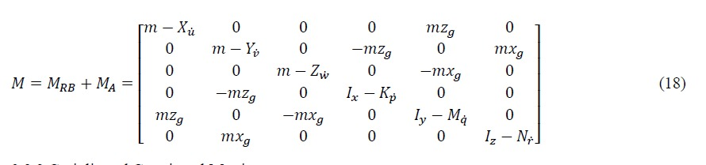

# AeroFusion: Autonomous BLIMP Navigation and Sensor Integration Platform

<!-- **Project Name:**  

_AeroFusion: Autonomous BLIMP Navigation and Sensor Integration Platform_   -->

**Team Number: 03**  

**Team Members:**  
- [Nihar Masurkar]
- [Prajjwal Dutta]
- [Sai Srinivas Tatwik Meesala]

**Semester and Year:**  
Spring 2025  

**University, Class, and Professor:**  

- **University:** Arizona State University  
- **Class:** RAS 598: Experimentation and Deployment of Robotic Systems
- **Professor:** [Dr. Daniel Aukes](https://www.danaukes.com/)

---

## **1. Introduction**
The project aims to develop an integrated, sensor-driven framework that enables a biologically inspired, lighter-than-air, Instructional, Mechatronics Program (BLIMP) UAV to operate autonomously and identify and track objects of interest in dynamic and uncertain environments.  

The central research question is: **"How effectively can sensor data from various sensors (such as IMU, Barometer and Camera) be fused to enhance the control systems and tracking capabilities of a hybrid robotic blimp system in dynamic environments?"**  

  
*Figure 1: CAD Rendering of Biologically-inspired, Lighter-than-air, Instructional, Mechatronics Program (BLIMP) UAV*  

The system aforementioned is an unmanned aerial system (UAS) that is used in the Defend the Republic competition. The UAS vehicles used resemble conventional airship profiles with similarities in maneuverability and control. While the problem of trajectory tracking is well researched, difficulties arise with lighter-than-air vehicles (LTAVs) and similar vehicles, as highly nonlinear behavior greatly defines the behavior of the system. Likewise, environmental disturbances can also influence system response. Prior research in the area has dealt with implementing PID and force-predictive controller strategies [1]. In terms of LTA vehicles specifically, the implementation of Linear Quadratic Regulator (LQR) control was explored utilizing conventional airship dynamics to represent the system behavior [6]. With the growing interest in autonomous technology, the use of smaller unmanned vehicles for research, academia, and military applications is an ongoing research topic. Consequently, effective and safe control strategies for such vehicles are of particular importance.  

For this project, and an invested interest in the coordination of unmanned underwater vehicles (UUVs), it was chosen to implement conventional UUV dynamics using an LTAV as the test bed vehicle. Using various methods, model parameters were identified, and the similarities in the model were proven. Different control strategies were investigated, including those aforementioned; however, it was observed that such control strategies were not sufficient for the system, due to high nonlinearities and the need to optimize trajectory tracking controls online to follow multiple trajectories. Consequently, a model predictive controller (MPC) was chosen for the system due to its effectiveness in producing online optimal control inputs and its efficiency at handling highly nonlinear systems.  

### Updated Project Goals

The project's original goal was to enable an autonomous blimp platform capable of detecting, tracking, and approaching an olive-colored balloon using computer vision and onboard sensors. Since the last update, we have refined our objectives to focus more explicitly on:

- Reliable balloon detection using a trained YOLOv5 model.
- Quadrant-based navigation logic based on object centroid position.
- Sensor fusion using the IMU and barometer for stabilized flight control.
- Differential drive-based motion to minimize hardware complexity.
- Real-time object tracking and task success based on position proximity to the image center.

These refinements helped narrow our scope and allowed us to focus efforts on perception-control integration while still meeting the autonomy requirements.


## **2. Methods**

### 2.1. Modeling  

  

To properly implement the control system, a dynamic model of the blimp had to be developed. The following equations (1) and (2) can be used to represent the dynamics of the LTA. The dynamic model includes both the kinematics (1) and the kinetics of the system (2). The kinematics of the system deals with how the object moves through space, while the kinetics of the system deals with how forces affect the motion of the vehicle. Before jumping to specific dynamic equations of the LTA, it is important to first define the reference frames and symbolic meaning of the variables used throughout the report. Two reference frames were used in developing the dynamic model: the inertial (Earth) reference frame and the fixed body frame. Figure 1 illustrates the reference frames that were considered.  

 

The inertial reference frame is “fixed” concerning the Earth. In most applications, it is assumed to be inertial, meaning the reference frame is subject to no acceleration. The body reference frame on the other hand is defined based on non-collinear points along the airship as illustrated above, with the x-axis pointing in the direction of forward motion, y-axis pointed towards the starboard (right) side of the airship, and the z-axis perpendicular to the plane produced by pointing downward through the hull. The 6 DOF model is used to represent the system.  

In the kinematic and kinetic equations above, subscript E denotes the inertial frame while subscript b denotes the body frame. Due to the complexity of the model, matrix notation was adopted for ease of calculation and representation. In the model 𝑥𝑏,𝑥̇𝑏,𝑥̈𝑏 are [6x1] vectors representing the vehicle's position, velocity, and acceleration in the body frame, respectively, while 𝑥𝐸 is a [6x1] vector representing the position of the vehicle in the Earth coordinate system. Vector notation is described as follows.  

 

In the equations above, the first three vector elements represent linear positions, velocities, and accelerations, while the last three vector elements represent angular positions, velocities, and accelerations in their respective coordinate systems. Inertial properties of the vehicle are accounted for by the [6x6] mass matrix, M. Coriolis and centripetal effects are accounted for by the [6x6] matrix, C. Damping effects are accounted for by the [6x6] damping matrix, D, and restoring forces and moments are accounted for by the [1x6] vector, 𝑔. The propulsive forces and moment acting on the vehicle are described by the [6x1] vector,𝜏𝑏. The aforementioned values will be described in detail in the succeeding sections.  

### 2.2. Kinematic Equation  
Euler angles can be used to transform both linear and angular velocities between the body frame and the inertial (NED) frame. The transformation for linear velocities from the body reference frame to the Earth reference frame is given by the following equation.  

 

Also, if it is warranted to transform the system from an inertial frame to the body frame, the transpose of the above equation is adopted 𝐽𝑇(Θ). Another important realization is that a pitch angle, 𝜃, equivalent to 90°, produces a singularity as there is no unique solution for angles 𝜑 and 𝜓. In such a case quaternion can be used to represent the orientation; however, it is not expected for the system to pitch at an angle close to 90°, so the Euler angle representation was considered to be sufficient for the model.  

### 2.3. Mass Matrix  
The mass matrix consists of the masses due to the rigid body and added or virtual masses. The added or virtual masses and inertia are usually not considered in conventional aircraft dynamics but can arise in the case of LTA vehicles and underwater vehicles due to the vehicle mass being the same order of magnitude as the displaced fluid. Therefore, the additional force resulting from the fluid acting on the structure must also be considered. The rigid body mass matrix is described in (14).  

 

In the matrix above, symbolic variable notation is as follows. 𝑚 is the mass of the vehicle. 𝐼𝑥, 𝐼𝑦, and 𝐼𝑧 are the moments of inertia about the 𝑥𝑏, 𝑦𝑏, and 𝑧𝑏 axes in the body reference frame. 𝐼𝑥𝑦=𝐼𝑦𝑥, 𝐼𝑥𝑧=𝐼𝑧𝑥, and 𝐼𝑦𝑧=𝐼𝑧𝑦 are the products of the moments of inertia, and 𝑟𝑔=[𝑥𝑔,𝑦𝑔,𝑧𝑔]𝑇 is the position of the COG (center of gravity) relative to the COB (center of buoyancy of the vehicle). Following this notation, a few assumptions can be made regarding the vehicle. At a base level, an assumption can be made that the vehicle is symmetric about all axes. Thus, the products of the moments of inertia can be simplified such that 𝐼𝑥𝑦=𝐼𝑦𝑧=𝐼𝑧𝑥=0. It can also be assumed that the position of the COG relative to the center of buoyancy is equivalent in both the x and y directions. Thus, 𝑥𝑔=𝑦𝑔=0. However, due to the presence of the gondola, which holds a significant amount of weight about the vehicle, 𝑧𝑔≠0. This will reduce (14) to (15) below.  

 

 

### 2.4. Coriolis and Centripetal Matrix  

The Coriolis and centripetal matrix contains the dynamic terms associated with the linear and angular velocities in the body reference frame. The Coriolis matrix is derived directly from the rigid body and added mass matrix. The Coriolis force is an inertial force that acts on objects in motion that rotate within a frame of reference (body reference frame) to an inertial frame. Centripetal force accounts for objects moving along circular paths. Matrix (19) below was used to account for these phenomena in the system [7].  

 

### 2.5. Damping Matrix  
The aerodynamic damping matrix is caused by friction effects, which are a function of the velocity of the vehicle. Two fundamental friction regions are considered: linear friction due to the laminar boundary layer and quadratic friction due to the turbulent boundary layer. This matrix also contains the effects of vortex shedding along the flow line. As indicated in [7], nondiagonal terms are relatively small and can be ignored. As such, a diagonal structure is developed for the damping matrix and can be approximated per (20).  

 

With the assumption that the vehicle will be in an indoor environment and operating at low speeds, a laminar boundary layer can be considered. Thus, the quadrating damping terms can be ignored, leaving only the linear skin friction coefficient.  

 

The coefficients presented above for the damping matrix can be estimated from wind-tunnel testing or system identification tools.  

### 2.6. Restoring Forces and Moments Vector
The restoring forces and moments term is a combination of gravity and buoyancy forces and moments. The buoyancy force is an aerostatic lift force acting on the vehicle and is derived from Archimedes' principle, which states that the buoyancy force is equivalent to the weight of the displaced fluid occupied by the volume of the vehicle. The two forces can be described as follows.  

 

In the above formula, the volume, 𝑉, of an ellipsoidal balloon can be described by 𝑉=4/3𝜋𝑎𝑏^2. Expressing these above terms in the inertial reference frame using Euler angle transformation yields (24).  

 

As aforementioned, the center of buoyancy is assumed to be located at the origin of the body. Thus, 𝑟𝑏=[𝑥𝑏 𝑦𝑏 𝑧𝑏]𝑇=[0 0 0]𝑇, and it is assumed that the x and y center of gravity positions coincide with the origin of the vehicle; however, due to the weight of the gondola, the z-directional center of gravity does not. Thus, 𝑟𝑔=[𝑥𝑔 𝑦𝑔 𝑧𝑔], 𝑇=[0 0 𝑧𝑔]𝑇. Therefore, the restoring forces and moments vector is reduced to the following.  

 

### 2.7. Propulsion Forces and Moments  
The control input is a vector of forces and moments. The produced forces are dependent on the number of thrusters, the mounting position, and the orientation of the thrusters. The general notation for the propulsion forces and moments is described by (26).  

 

In terms of control inputs, the propulsion forces and moments can be written per the following.  

 

In the above equation, 𝑇 is the thrust configuration matrix. In the case of the current vehicle setup, there are a total of four thrusters producing 𝑇=[𝑇1 𝑇2 𝑇3 𝑇4]. The forces and moments produced by each thruster can be calculated per the following equation.  

As noted in (27), the force is a function of the control input (PWM) signal and the thrust coefficient matrix, K, which describes how the PWM signals relate to the thrust force for a specific motor setup. These values can be experimentally calculated and will be described in a later section.  

### 2.8. Control System
Control allocation allows the computation of the input signal, 𝑢, to apply to the thrusters for the propulsive forces and moments to be produced.  

 

It should be noted that the thruster allocation matrix is non-square due to there being a total of four thrusters and 6 DOF. Consequently, an alternative method to find the inverse is needed, such as the Moore-Penrose pseudo-inverse. Therefore, the control input vector, 𝑢, can be determined by the following equation.  

 

It should be noted that the MPC controller developed calculates an optimized control input to each motor using a different methodology than described above. However, if tuning the system via PID control, equation (30) can be used to calculate the control input based upon some error that is tuned by the control gains.  

### 2.9. Linearization
For practical purposes, it is necessary to discretize and linearize the dynamic model. As previously noted, the vehicle dynamics are highly nonlinear. Therefore, to handle this issue a state space model was developed which provides a convenient platform for handling multiple-input-multiple-output (MIMO) systems. The state vector [12x1] and control input vector [4x1] were identified and are shown below.  

 

At this point, the general form of the nonlinear state space model can be developed per the following equations.  

 

For the proposed model, it is assumed that the output of the state space model, 𝑦(𝑡), is equivalent to the current state of the system 𝑥(𝑡). Expressing the kinetic equation in terms of the highest order state (acceleration) gives.  

 

Solving this equation allows us to write the continuous-time state-space formulation as described in (36) and (37).  

 

In order to find the state transition matrix, 𝐴, and the input matrix, 𝐵, the Jacobian matrix is needed to make a linear approximation of the nonlinear system. The Jacobian makes a linear approximation of the nonlinear function around a point of interest using a first order Taylor Series expansion. The general form of the Jacobian linearization matrix is presented below.  

 

Thus, the state transition matrix, 𝐴, and input matrix, 𝐵, can be described by the Jacobian linearization such that.  

 

## 3. **System Identification**  

The dynamic model of the vehicle described above requires the identification of the system parameters listed below.  

 

There are various ways to go about calculating the unknown parameters in the system. For the purposes of the project SolidWorks CAD modeling, theoretical calculations, and experimental tests were performed to identify and validate the model.  

### 3.1. CAD Model Measurements  
Due to the various vehicle prototypes being developed throughout the course of the semester, a CAD model was employed to find inertial and geometrical characteristics that could easily be updated to represent the current configuration of the vehicle.  

 

The CAD model in Figure 3 provides a framework to reassess the geometrical and inertial parameters with different envelope sizes, motors, gondola and net configurations. Using this model the following parameters were identified.  

 

Particularly interesting in the results are the rigid body mass matrix and center of gravity matrix. In the modeling section, it was noted that, due to symmetry, off-diagonal terms in the rigid body mass matrix were negligible, and that the weight of the gondola would affect only the center of gravity in the z-direction. This assumption is reflected in the results for the SolidWorks CAD model of the vehicle.  

### 3.2. Theoretical Calculations  

To calculate the virtual/added mass factors, a theoretical method is utilized that uses the geometry of the vehicle and the kinetic energy of an ideal fluid volume around the moving vehicle. Virtual mass calculations are equivalent to the density of the surrounding fluid multiplied by a volume that depends on the geometric shape of the body. Lamb’s k-factor method was utilized to calculate the added mass of the balloon. Whereas the ellipsoid equation in the body frame is represented by (41).  

 

Applying symmetry and Lamba k-factors to the vehicle, the added mass factors can be calculated using Lamb’s k-factor coefficients.  

 

Applying the above equations, the added mass values can be found and are represented in Table 3 below.  

 

Using the identified values from both the CAD model and the theoretical calculations, the mass, Coriolis, and centripetal matrices were accounted for. Thus, the only remaining parameters left to be identified are the thrust coefficient matrix and the damping matrix.  

### 3.3. Experimental Calculations

The thrust coefficient matrix can be calculated directly from thrust stand data. In this test, a known PWM (pulse width modulation) signal is sent to the motor, which is attached to a stationary stand that measures the thrust force of the motor configuration. The current vehicle configuration uses a Park 180 motor for the left and right thrusters and a Park 250 motor for the up and down motors. A step test was performed for each motor in which the PWM signal was varied from 1100 to 1800 in increments of 50, and the resulting data is shown in Table 4 below.

 

The data above was then plotted for each motor. As Figures 4 and 5 below illustrate, Thrust vs. PWM exhibits a near-linear relationship. Thus, a linear equation was fit to the data to be used in the thrust coefficient matrix.  

 

Unlike previously identified parameters, damping effects are less straightforward to calculate. Wind tunnel testing or computer-aided computational fluid dynamics tests can be used to identify the parameters. Another option, and the chosen one for this project, is dynamic testing. For this test, the MoCap Lab and the Vicon System in the lab ( TECH 189) are used to accurately track the vehicle's state during flight tests. The Vicon system uses a series of infrared cameras and, when properly calibrated, can accurately provide dynamic measurements down to 0.017 mm on average [source]. During testing, motor inputs were recorded alongside Vicon data measurements. After running multiple free-flight test trials, the data reduction was performed using MATLAB to calculate the damping coefficient at each time step. The median of this data was then used to represent the damping coefficient for a singular test, and then the average of all trials was taken. This experiment resulted in the following data for the damping coefficient.  

 

It should also be noted that, ideally, single DOF tests would be performed at constant velocities. Thus, eliminating acceleration and thereby mass effects, and also minimizing any potential coupling effects between the parameters. However, due to limited control, all 6 DOF cannot be independently controlled and achieving a constant velocity in an enclosed space can be difficult. Therefore, it was assumed that various flight tests would be sufficient for the calculation.  

#### Result:

Experimental tests were performed to validate the identified model. In these tests simple trajectory experiments were performed in the Lab and Vicon data was recorded alongside motor inputs. The motor inputs were then extracted and used as inputs to the dynamic model. Making use of the forward kinematics of the system, the theoretical calculation of position was compared to the experimental position measurement. Figure 6 illustrates theoretical and experimental measurements for a ‘forward only’ motion, while Figure 7 illustrates the results for a ‘vertical only’ motion.

.jpg) 

.jpg) 


Model validation through experimentation authenticates the similarities between LTAVs and UUVs. As such, it can be reasonably stated that conventional UUV dynamic equations can be used to represent the behavior of an LTAV.  
### 3.4. Sensor Integration

Sensor integration in the project adopts a comprehensive, multi-layered approach to ensure effective utilization of data from each sensor across all development stages. The team aims to implement a modular architecture in the codebase where sensor data is published on dedicated ROS2 topics. Each sensor continuously streams its specific measurements, facilitating both independent processing and integrated sensor fusion.  

The code utilizes a hierarchical data processing pipeline:  

1. **Data Acquisition Layer**: Handles raw sensor input collection at appropriate sampling rates.
2. **Filtering Layer**: Applies Kalman filtering and other noise reduction techniques.
3. **Fusion Layer**: Combines multiple sensor inputs for comprehensive state estimation.
4. **Decision Layer**: Processes fused data to inform navigation and control decisions.

### 3.5. Data Collection Process

During testing, the team will validate individual sensor outputs using ROS2 tools like rqt_plot and ros2 topic echo. This methodical approach ensures each sensor is correctly calibrated and operating within expected parameters. The testing protocol includes:

- **Sensor Isolation Tests**: Verifying each sensor's accuracy and reliability independently.
- **Calibration Verification**: Ensuring sensors maintain accuracy across varying conditions.
- **Interference Testing**: Identifying potential cross-sensor interference issues.
- **Data Consistency Checks**: Confirming consistent readings under controlled conditions.
- **Latency Measurement**: Quantifying processing delays for time-sensitive applications.

These tests will be conducted in controlled indoor environments and field trials, allowing us to observe how sensor data influences the system's stability, localization accuracy, and obstacle detection capabilities in diverse settings.  

In the final demonstration, real-time integration of sensor data will be paramount. Each sensor will play a specific role in enabling autonomous operation:  

- **IMU**: Provides orientation control with 6-DoF motion tracking at 200Hz.
- **Barometer**: Maintains precise altitude control through atmospheric pressure monitoring.
- **Raspberry Pi Camera**: Supports visual goal detection and obstacle recognition at 30fps.

  
*Figure 2: BLIMP Sensor Connection Block Diagram*

### 3.6. Object Detection and Model Fitting
The team trained a custom **YOLOv5s** model to detect olive-colored balloons, which are the objects of interest.  

**Training details:**  
- Platform: Roboflow + local training
- Dataset: Collected in variable lighting/backgrounds
- mAP@0.5: ~96%
- Inference time: ~20ms (GPU), <100ms (CPU)

Upon detection, the model calculates the centroid of the balloon and converts it to **relative pixel coordinates**, using the frame's center as the origin. This enables both quadrant classification (`Q1–Q4`) and distance estimation.  
 
  
*Figure 1: Real-time detection of the green target balloon using a custom-trained YOLOv5 model with quadrant-based localization.*  

The team used the object's position relative to the center to command differential drive actions. As the object nears the center, the blimp slows down and halts when it reaches a defined "success zone."  

---

### 3.7. Validation and Success Metrics

 **GUI Mockup for ROS-based Sensor Visualization**

The ROS-based GUI can be enhanced to include real-time streaming of sensor topics, providing a comprehensive visualization tool for debugging and monitoring system performance. The interface should consist of:

- **Live Sensor Data Feeds**: Displaying IMU, barometer, and camera outputs.
- **Real-Time 3D Mapping**: Visualization of detected obstacles and planned trajectories.
- **System Status Indicators**: Battery levels, motor commands, and control mode (manual/autonomous).
- **Logging & Playback**: Time-stamped data recording for post-mission analysis.


The GUI is built using a ROSBridge Websocket that subscribes to all the sensor data. 

These updates ensure that the sensor fusion and autonomy modules operate efficiently, providing real-time insights into the BLIMP's state during both testing and deployment.  

This comprehensive sensor array will drive the autonomous control loops, enabling adaptive trajectory planning and responsive mode switching between manual and autonomous control. The demonstration will showcase how the fusion algorithms synthesize this diverse data to create a cohesive understanding of the environment, allowing the BLIMP to navigate reliably in dynamic, real-world scenarios.  
### 3.8. Interface Development

The behavior of the BLIMP will be influenced through a sophisticated dual-mode control strategy that balances user input with autonomous decision-making. The team has designed:

1. **Manual Control Mode**: Users can precisely adjust the robot's throttle, direction, and altitude via a joystick interface, allowing for direct control during setup, testing, and emergencies.

2. **Autonomous Mode**: The robot will employ advanced trajectory planning algorithms based on goal positions detected by the onboard camera. The system will continuously process sensor data to maintain a stable flight while navigating toward objectives.

3. **Mode Switching**: A dedicated joystick button will facilitate seamless transitions between manual and autonomous operations, ensuring operators can quickly regain control if needed.

4. **Emergency Override**: Safety-critical sensors will trigger automatic responses regardless of current mode, such as obstacle avoidance maneuvers or altitude corrections.

This hybrid approach provides flexibility while maintaining safety and mission objectives.

The team is developing a comprehensive GUI based on ROS that serves multiple functions:

1. **Real-time Data Visualization**: 
   
      - Sensor data dashboards displaying IMU, barometer, GPS, camera, sonar, and LiDAR outputs.
      - Interactive 3D map showing current position, trajectory, and detected obstacles.
      - System status indicators including battery levels, motor outputs, and connection quality. 

2. **Control Interface**:
   
      - Mode selection panel (manual/autonomous).
      - Manual control input visualization.
      - Goal setting and waypoint management tools.
      - Parameter adjustment sliders for tuning control algorithms.

3. **Data Logging and Analysis**:
   
      - Comprehensive time-stamped data recording of all sensor inputs.
      - Performance metrics tracking, including stability measures and navigation accuracy.
      - Export functionality for post-mission analysis.
      - Replay capabilities for reviewing flight data.

This integrated interface will not only enable immediate interaction during operation but also support detailed post-mission analysis and system refinement.

## 4. **Project Process/Workflow**
The workflow involved weekly iteration and testing across three verticals: hardware integration, software development, and sensor-based control logic.
Key workflow highlights:

   - Early-stage testing of sensors: IMU, barometer, and camera modules.
   - Development of a modular ROS 2 architecture.
   - Collection and labeling of balloon images for training.
   - Training of YOLOv5 using Roboflow-annotated data.
   - Integration of detection results into a quadrant mapping logic node.
   - Real-world validation through indoor tethered testing.

We followed a tight loop of code-deploy-test-debug with each sensor modality until full system integration.

## 5. **System Tradeoffs & Technical Considerations**

- **YOLOv5 vs. Color Thresholding:** We opted for a trained YOLOv5 model instead of simple blob detection. While this required more up-front work (data collection and training), it provided robustness in variable lighting.

- **IMU + Barometer Fusion:** We avoided using GPS or LiDAR for simplicity. The decision was made to trade positional accuracy for faster, more reactive control using sensor fusion of onboard IMU and barometric pressure.

- **Differential Drive Control:** Instead of complex motion planning, we used a direct mapping from image-space offset to control output. This significantly reduced computation time and control latency.

- **ROS 2 Simplicity:** We avoided custom middleware and kept communication to ROS 2 topics and standard packages, minimizing overhead.

## 6. **What did we learn?**

- **Sensor Fusion:** Hands-on experience fusing noisy sensor data taught us the importance of calibration and filtering. We learned to work with real-world imperfections in IMU/barometer readings.
- **Training Computer Vision Models:** We developed a better understanding of labeling strategies, data augmentation, and how inference performance varies between GPU and CPU.
- **ROS 2 Practices:** Designing modular ROS 2 nodes helped us better grasp the advantages of loosely coupled systems.
- **Iterative Debugging:** The importance of visualizing intermediate outputs (OpenCV overlays, topic echo, rqt_graph) became apparent, allowing us to fix bugs faster.

## 7. **Future Considerations**

- **PID Control for Smoothness:** Our current control is reactive. Adding PID loops will help dampen overshoot and allow finer movement.
- **3D Localization:** Incorporating a forward-facing range sensor could allow for estimating object depth, enabling true 3D navigation.
- **Fallback Strategies:** Implementing lost-object recovery and search behavior would make the system more resilient.
- **State Machine Architecture:** Transitioning from basic logic to a hierarchical state machine could improve scalability and robustness.
- **Model Optimization:** Quantization or pruning of YOLOv5 could allow faster inference on low-power devices.
- **Outdoor Capability:** With GPS integration and larger test environments, we could extend the system for outdoor deployments.


## 8. **Project Timeline**

| Week | Hardware                            | Software                          | Testing                              | Status |
|------|-------------------------------------|-----------------------------------|--------------------------------------|--------|
| 7    | Set up core hardware components     | Create basic user interface       | Test basic sensors (IMU, GPS)        | ✅     |
| 8    | Test power systems and batteries    | Develop interface mockups         | Install and test distance sensors    | ✅     |
| 9    | Test motors and speed controllers   | Connect interface to ROS          | Begin data collection from sensors   | ✅     |
| 10   | Extend hardware setup, wiring       | Add real-time sensor displays     | Calibrate initial sensors            | ✅     |
| 11   | Complete system integration         | Set up data storage + logging     | Begin combining sensor inputs        | ✅     |
| 12   | Start motor tuning + prop checks    | Add map view to interface         | Initial static testing of camera     | ✅     |
| 13   | Prep for flight & safety checks     | Finalize ROS visualization setup  | Validate sensor fusion               | ✅     |
| 14   | Conduct **initial flight tests** ✈️  | Basic control tuning via interface| Monitor live telemetry, adjust logs  | ✅     |
| 15   | Refine hardware from flight data    | UI polish & final features        | Autonomous flight path tuning        | ✅     |
| 16   | Final fixes and mounting upgrades   | Bugfix and code cleanup           | Final demo rehearsal & testing       | ✅     |

**Legend:**  

- ✅ = Completed  
- 🔄 = In Progress  
- 🕒 = Pending  

<!-- ## Gantt Chart -->
<!-- ```mermaid
%%{init: {'themeVariables': {'opacity': '1'}}}%%
gantt
    title Simplified Project Timeline (March - May)
    dateFormat  YYYY-MM-DD

    section Hardware & Sensors
    Hardware setup & testing       :done,   2025-03-04, 21d
    System wiring & integration    :done,   2025-03-25, 7d
    Flight tests & optimization    :done, 2025-04-01, 14d
    Final refinements & demo prep  :done, 2025-04-17, 14d

    section Software & Interface
    GUI design & mockups           :done,   2025-03-24, 14d
    ROS integration & visualization:done,   2025-03-10, 20d
    UI development & testing       :done, 2025-04-08, 14d
    Documentation & finalization   :done, 2025-04-22, 10d

    section Controls & Autonomy
    Manual control & tuning        :done,   2025-03-04, 14d
    Stability & trajectory planning:done,   2025-03-18, 14d
    Autonomy & path following      :done, 2025-04-08, 14d
    Final optimization & demo      :done, 2025-04-24, 10d
``` -->