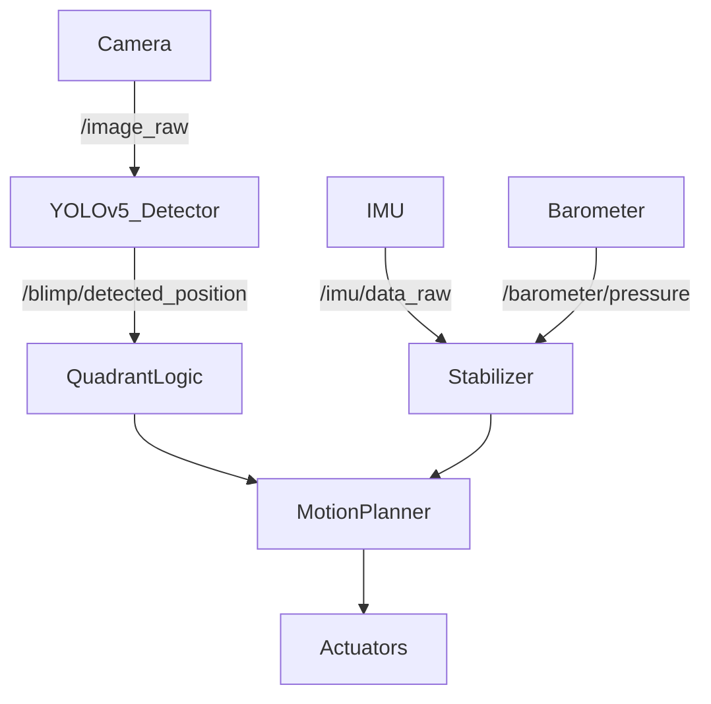

## Team Assignment 4

Since the last milestone, the team has made substantial progress in developing both the sensing and autonomy stack. the primary focus is building a system that can identify and track an **olive-colored balloon** in real time, navigate toward it using differential drive, and determine success based on proximity to the center of the camera frame.

This work integrates multiple sensing modalities: camera, IMU, and barometer alongside autonomous behavior through ROS2 nodes and coordinated control logic.

---

## Sensor Integration and Filtering

The team is currently using three primary sensors:

- **Camera (USB webcam)** for image acquisition and target detection
- **ICM20948 IMU** for measuring orientation and motion
- **Barometer** for height estimation and stabilization

The IMU and barometer data undergo filtering and fusion, providing stable orientation and altitude feedback. The camera provides vision-based input used primarily for high-level object detection and tracking.

### Active ROS Topics (place holder)

```
/image_raw                # Camera feed 
/blimp/detected_position  # YOLO-based balloon detection 
/imu/data_raw             # IMU (gyro, accel, fused orientation) 
/imu/mag                  # Magnetometer readings 
/barometer/pressure       # Altitude estimation
```

The fusion of IMU and barometer data allows for stable low-level control, while the camera provides the primary input for high-level decision-making.

---

## ## Object Detection and Tracking

The team trained a custom **YOLOv5s** model to detect olive-colored balloons, which are the objects of interest.

**Training details:**  
- Platform: Roboflow + local training
- Dataset: Collected in variable lighting/backgrounds
- mAP@0.5: ~96%
- Inference time: ~20ms (GPU), <100ms (CPU)

Upon detection, the team calculate the centroid of the balloon and convert it to **relative pixel coordinates** with the frame’s center as origin. This allows quadrant classification (`Q1–Q4`) and distance estimation.  

The team used the object's position relative to the center to command differential drive actions. As the object nears the center, the blimp slows down and halts when it reaches a defined "success zone."

---

## Object Tracking and Success Criteria

The object tracking strategy is based on the **distance between the detected object’s centroid and the center of the frame**. The logic is as follows:

1. YOLO detects the object and computes its (x, y) position.
2. The team measured the offset from the image center.
3. This offset is used to determine the movement direction via differential drive.
4. When the object enters a predefined central "success zone", the task is marked complete and the blimp halts.

This behavior mimics a form of visual servoing, using object position rather than absolute coordinates to navigate.

## Low-Level and High-Level Autonomy

### Low-Level Autonomy

Low-level autonomy includes all real-time control and stabilization functions:

- **IMU + Barometer Fusion**: Estimating attitude (roll, pitch, yaw) and height.
- **Sensor Filtering**:
  - Low-pass filters on accelerometer data to reduce noise
  - Complementary filters for fusing orientation data
- **PID Control (planned)**: For motor and throttle regulation.
- **Motor Feedback (encoders)**: Used for velocity and position tracking.

### High-Level Autonomy

High-level autonomy focuses on decision-making and planning:

- **Object detection with YOLOv5**: Identifying the balloon in frame
- **Quadrant classification**: Mapping position to Q1–Q4 based on pixel coordinates
- **Movement control**: Commands based on detected quadrant
- **Goal logic**:  
  - If object is off-center → adjust orientation and move
  - If object is centered → stop motors and flag task as completed
- **Fallback logic** (planned): Handle scenarios where the object leaves the frame

---

## Conditioning and Filtering of Sensor Data

Effective autonomy depends on reliable sensor input. Here’s how the team will manage each:

### Camera (Vision Input)

- **Contrast Enhancement**: Histogram equalization and HSV color space for better robustness under changing lighting.
- **Filtering**: Median filtering and Gaussian blurring to suppress noise.
- **Region of Interest (ROI)**: Focus processing on central region to improve performance.

### IMU

- **Sensor Fusion**: Combining gyro, accel, and mag data using complementary filters.
- **Filtering**: Low-pass filtering for accel and magnetometer data; high-pass to correct gyro drift.

### Barometer

- **Smoothing**: Simple moving average to eliminate spikes.
- **Correlation**: Used alongside IMU for stable vertical state estimation.

### Motors

- **PID Controllers (planned)**: For consistent and smooth motion.
- **Encoder Feedback**: To adjust velocity in real time.
- **Noise Filtering**: Reduce jitter in encoder readings via smoothing.

---

## Decision-Making Overview

Sensor data feeds into both short-term (control) and long-term (behavioral) decisions:

### Low-Level Decisions

- Set PWM/motor speeds based on position errors
- Adjust throttle for altitude using barometer
- Stabilize yaw using IMU orientation
- Apply real-time filters for smoother control

### High-Level Decisions

- Use YOLO to detect and localize the balloon
- Estimate relative direction and command movement
- Track proximity to frame center and decide when to stop
- Manage behavioral states: searching → tracking → stop

---

## Updated Sensor Flowchart


# Need: rqt graph.....

## Summary

The system can now: 

- Detect and track a balloon in real time
- Move toward the object using differential drive
- Halt autonomously when a success zone is reached
- Publish and use filtered sensor data from IMU and barometer

Next Goals:

- Integrate PID control for smoother navigation
- Add fallback logic if the object is lost
- Tune the success detection thresholds
- Record and analyze system performance using rosbag