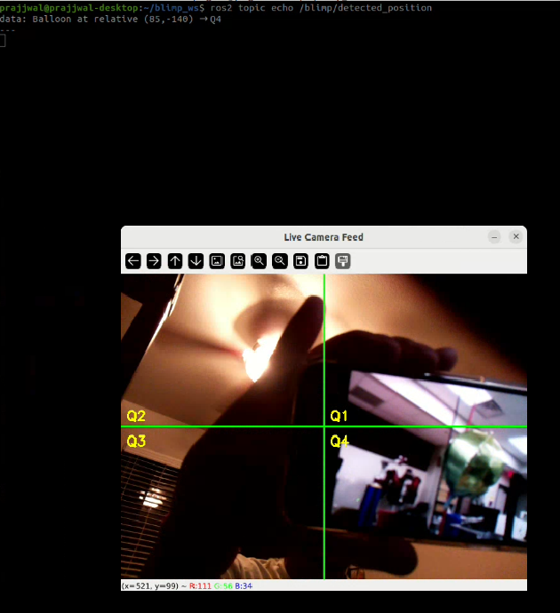
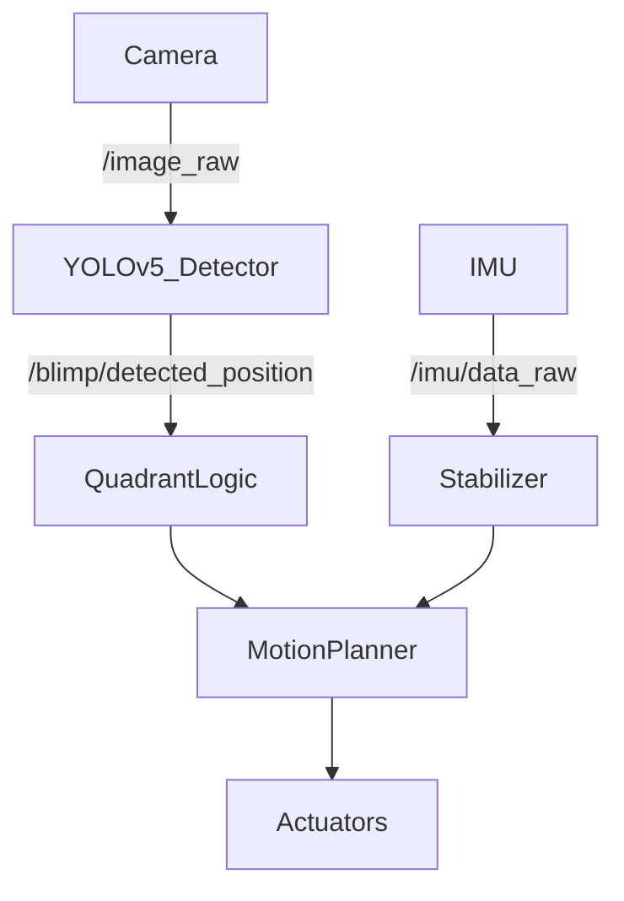

## Team Assignment 4

Since the last milestone, the team has made substantial progress in developing both the sensing and autonomy stack. the primary focus is building a system that can identify and track an **olive-colored balloon** in real time, navigate toward it using differential drive, and determine success based on proximity to the center of the camera frame.

This work integrates multiple sensing modalities: camera, and IMU alongside autonomous behavior through ROS2 nodes and coordinated control logic.

---

## Sensor Integration and Filtering
 
The team is currently using three primary sensors:

- **Camera (USB webcam)** for image acquisition and target detection
- **ICM20948 IMU** for measuring orientation and motion

The camera provides vision-based input used primarily for high-level object detection and tracking.

### Active ROS Topics (place holder)

```
/image_raw                # Camera feed 
/blimp/detected_position  # YOLO-based balloon detection 
/imu/data_raw             # IMU (gyro, accel, fused orientation) 
/imu/mag                  # Magnetometer readings 
```

---

## Object Detection and Tracking

The team trained a custom **YOLOv5s** model to detect olive-colored balloons, which are the objects of interest.

**Training details:**  
- Platform: Roboflow + local training
- Dataset: Collected in variable lighting/backgrounds
- mAP@0.5: ~96%
- Inference time: ~20ms (GPU), <100ms (CPU)

Upon detection, the team calculate the centroid of the balloon and convert it to **relative pixel coordinates** with the frame’s center as origin. This allows quadrant classification (`Q1–Q4`) and distance estimation.  

  
*Figure 1: Real-time detection of the green target balloon using a custom-trained YOLOv5 model with quadrant-based localization.*


The team used the object's position relative to the center to command differential drive actions. As the object nears the center, the blimp slows down and halts when it reaches a defined "success zone."

---

## Object Tracking and Success Criteria

The object tracking strategy is based on the **distance between the detected object’s centroid and the center of the frame**. The logic is as follows:

1. YOLO detects the object and computes its (x, y) position.
2. The team measured the offset from the image center.
3. This offset is used to determine the movement direction via differential drive.
4. When the object enters a predefined central "success zone", the task is marked complete and the blimp halts.

This behavior mimics a form of visual servoing, using object position rather than absolute coordinates to navigate.

  
*Figure 2: Directional movement commands are generated based on the detected position of the target balloon within the camera frame.*


## Low-Level and High-Level Autonomy

### Low-Level Autonomy

Low-level autonomy includes all real-time control and stabilization functions:

- **IMU**: Estimating attitude (roll, pitch, yaw)
- **Sensor Filtering**:
  - Low-pass filters on accelerometer data to reduce noise
  - Complementary filters for fusing orientation data
- **PID Control (planned)**: For servo and throttle regulation.
- **Servo Feedback (encoders)**: Used for velocity and position tracking.

### High-Level Autonomy

High-level autonomy focuses on decision-making and planning:

- **Object detection with YOLOv5**: Identifying the balloon in frame
- **Quadrant classification**: Mapping position to Q1–Q4 based on pixel coordinates
- **Movement control**: Commands based on detected quadrant
- **Goal logic**:  
  - If object is off-center → adjust orientation and move
  - If object is centered → stop servos and flag task as completed
- **Fallback logic** (planned): Handle scenarios where the object leaves the frame

---

## Conditioning and Filtering of Sensor Data

Effective autonomy depends on reliable sensor input. Here’s how the team will manage each:

### Camera (Vision Input)

- **Contrast Enhancement**: Histogram equalization and HSV color space for better robustness under changing lighting.
- **Filtering**: Median filtering and Gaussian blurring to suppress noise.
- **Region of Interest (ROI)**: Focus processing on central region to improve performance.

### IMU

- **Sensor Fusion**: Combining gyro, accel, and mag data using complementary filters.
- **Filtering**: Low-pass filtering for accel and magnetometer data; high-pass to correct gyro drift.

### Servos

- **PID Controllers (planned)**: For consistent and smooth motion.
- **Encoder Feedback**: To adjust velocity in real time.
- **Noise Filtering**: Reduce jitter in encoder readings via smoothing.

---

## Decision-Making Overview

Sensor data feeds into both short-term (control) and long-term (behavioral) decisions:

### Low-Level Decisions

- Set PWM/servo speeds based on position errors
- Adjust throttle for altitude
- Stabilize yaw using IMU orientation
- Apply real-time filters for smoother control

### High-Level Decisions

- Use YOLO to detect and localize the balloon
- Estimate relative direction and command movement
- Track proximity to frame center and decide when to stop
- Manage behavioral states: searching → tracking → stop

---

## Updated Sensor Flowchart


<!-- # Need: rqt graph..... -->

## GUI Update

The current Graphical User Interface (GUI) has been developed using a ROS 2 WebSocket-based architecture to support real-time visualization and control of the aerial robot during operation. The primary motivation for adopting this architecture stemmed from limitations observed during early testing—specifically, significant latency and bandwidth constraints when streaming video data directly from the onboard Raspberry Pi via conventional tools such as RQT or VNC.

To address this, the team implemented the GUI as a lightweight web-based interface that runs on a remote laptop and communicates with the ROS 2 ecosystem on the Raspberry Pi using rosbridge_server over WebSockets. This setup allows bidirectional data exchange between ROS 2 nodes and the browser using JSON-formatted ROS messages, enabling flexible interaction with ROS topics and services in real time.

The GUI was built using:

- HTML/CSS/JavaScript for the front-end structure and styling

- roslibjs to establish WebSocket communication with ROS 2 topics and services

- rosbridge_server as the ROS 2 backend middleware bridge that translates between ROS messages and WebSocket traffic

This approach allows for:

- Live visualization of camera streams (via web_video_server or MJPEG)

- Real-time IMU and telemetry display

- Joystick or button-based command publishing for manual control

- Status monitoring and diagnostic readouts

By offloading GUI rendering and interaction to a browser, the Raspberry Pi’s limited resources are preserved for essential ROS 2 computation and sensor integration tasks. The result is a responsive and lightweight GUI that operates efficiently over a network connection—even when the robot is airborne.

  
*Figure 3: Real-time sensor and control interface for the BLIMP, developed using roslibjs and rosbridge_server over WebSockets.*


<h2>📹 Balloon Tracking Demo</h2>

<video controls autoplay muted loop playsinline width="640" height="360" style="border-radius: 10px; box-shadow: 0 0 10px rgba(0,0,0,0.2);">
  <source src="/videos/balloon_detection.mp4" type="video/mp4">
  Your browser does not support the video tag.
</video>


## Summary

The system can now: 

- Detect and track a balloon in real time
- Move toward the object using differential drive
- Halt autonomously when a success zone is reached
- Publish and use filtered sensor data from IMU

Next Goals:

- Fully synchronize the GUI to work with the camera detection nodes along with the motor control nodes
- Integrate PID control for smoother navigation
- Add fallback logic if the object is lost
- Tune the success detection thresholds
- Record and analyze system performance using rosbag