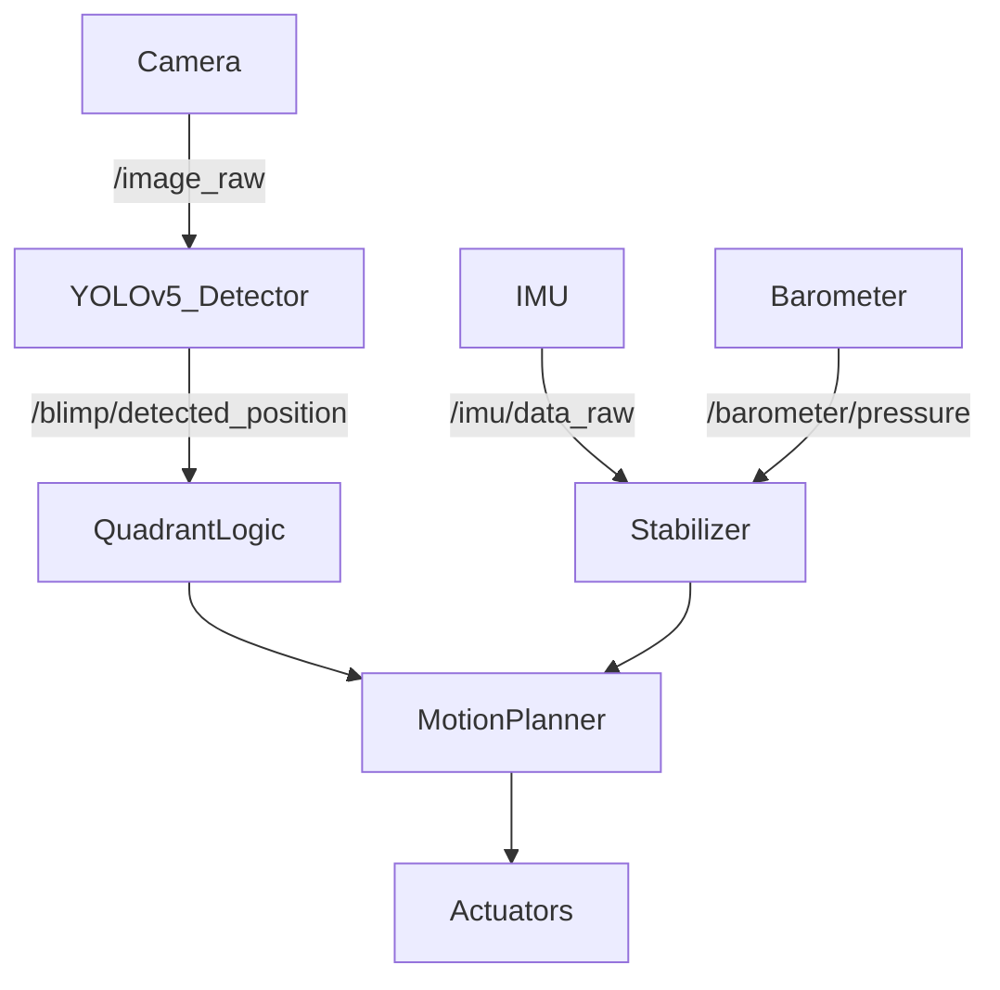

## Team Assignment 4

Since the last milestone, our team has made substantial progress in developing both the sensing and autonomy stack. Our primary focus is building a system that can identify and track an **olive-colored balloon** in real time, navigate toward it, and determine success based on proximity to the camera frame’s center.

This work integrates multiple sensing modalities (camera, IMU, barometer) with autonomous behavior through ROS2 nodes and control logic.

---

## Sensor Integration and Filtering

We are currently using three key onboard sensors:

- **Camera (USB webcam)** for real-time image acquisition.
- **ICM20948 IMU** for orientation, angular velocity, and acceleration.
- **Barometer** for altitude estimation and height feedback.

The IMU pipeline includes filtering and sensor fusion via quaternion-based orientation estimation. We compensate for drift and offset using calibration and smoothing techniques. Processed data is published via ROS topics including:

```
/image_raw                  # Camera image feed
/blimp/detected_position    # YOLO-based quadrant detection
/imu/data_raw               # Filtered IMU output
/imu/mag                    # Magnetometer field readings
/barometer/pressure         # Atmospheric pressure readings
```


The fusion of IMU and barometer data allows for stable low-level control, while the camera provides the primary input for high-level decision-making.

---

## Object Detection with YOLOv5

We trained a YOLOv5 model specifically to detect **olive balloons**, which serve as our object of interest. 

### Training Details:
- Model: YOLOv5s
- Dataset: Custom-labeled images collected in various lighting conditions
- Annotations: Done using Roboflow
- Metrics:
  - mAP@0.5: ~96%
  - Inference time: ~20ms on GPU, <100ms CPU

The trained model is deployed in a ROS2 node, which outputs the location of the detected object in pixel space. We convert the object's position into **relative coordinates centered at the image midpoint**, then determine the corresponding quadrant (`Q1` to `Q4`).

---

## Object Tracking and Success Criteria

Our object tracking strategy is based on the **distance between the detected object’s centroid and the center of the frame**. The logic is as follows:

1. YOLO detects the object and computes its (x, y) position.
2. We measure the offset from the image center.
3. This offset is used to determine the movement direction via differential drive.
4. When the object enters a predefined central "success zone", the task is marked complete and the blimp halts.

This behavior mimics a form of visual servoing, using object position rather than absolute coordinates to navigate.

---

## Autonomy Architecture

### Low-Level Autonomy
Handles stabilization, pose estimation, and motion commands. It uses:

- IMU + Barometer data for roll/pitch/yaw and altitude control.
- PID loops (planned) to maintain desired orientation and throttle.
- Basic ROS2 nodes to publish and monitor sensor data.

### High-Level Autonomy
Responsible for goal setting and behavioral logic:

- Detects and tracks the object of interest.
- Makes decisions based on quadrant location and position error.
- Switches control states based on proximity thresholds and object presence.
- Eventually will manage search and reacquisition behavior if the target is lost.

---

## Updated Sensor Flowchart


# Need: rqt graph.....

## Summary

With balloon detection working reliably and the IMU + barometer data integrated, the system is now capable of:

- Locating the balloon
- Moving toward it
- Detecting when the goal is reached

Next steps include refining PID-based orientation control, implementing robust fallback states (e.g. object lost), and fine-tuning response thresholds for consistent autonomous behavior.